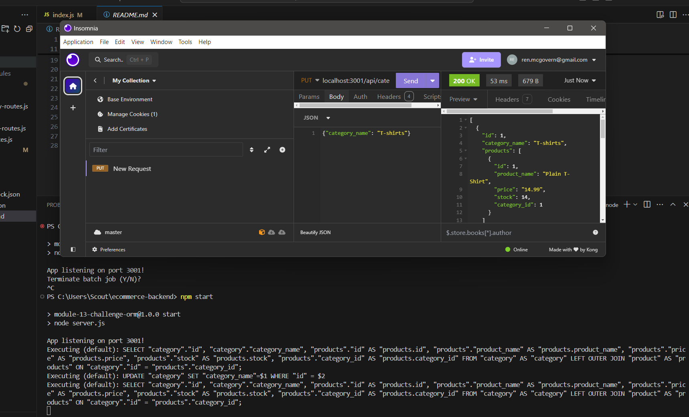

# E-commerce Back End Starter Code

## Description
> Using **Express.js**, **Sequelize**, and **PostgreSQL**, the goal of this challenge is to build a backend for an e-commerce site.

## Table of Contents
I. [Acceptance Criteria](#acceptance-criteria)  
II. [Image Example of App](#image-of-working-app)  
III. [Video Walk-through Tutorial](#video-tutorial)  
IV. [Source Code Credit](#starter-code-credit-httpsgithubcomcoding-boot-campbookish-sniffletreemain)

## Acceptance Criteria
> - GIVEN a functional Express.js API
> -  When I add my database name, PostgreSQL username and password to a .env
>   - I am able to connect to a database using Sequelize
> - When I enter schema and seed commands
>   - A development database is created and is seeded with test data
> - When I enter the command to invoke the application
>   - My server is started and Sequelize models are synced to the PostgreSQL database
> - When I open API GET routes in Insomnia Core for categories, products, or tags
>   - The data for each of these routes is displayed in a formatted JSON
> - When I test API POST, PUT, and DELETE routes in Insomnia Core
>   - I am able to successfully create, update, and delete data in my database

## Image of Working App
This App runs in insomnia!  Connect your server via npm i and you'll be able to access the routes!  

## Video Tutorial
I accidentally updated the id of 4 and the id of 1 in the video tutorial, but in the panic of being on-screen simply did both!  
 
**[Video](https://app.screencastify.com/v3/watch/8Cwl2FtOcvyyxcaysGGk)**

### starter code credit: https://github.com/coding-boot-camp/bookish-sniffle/tree/main